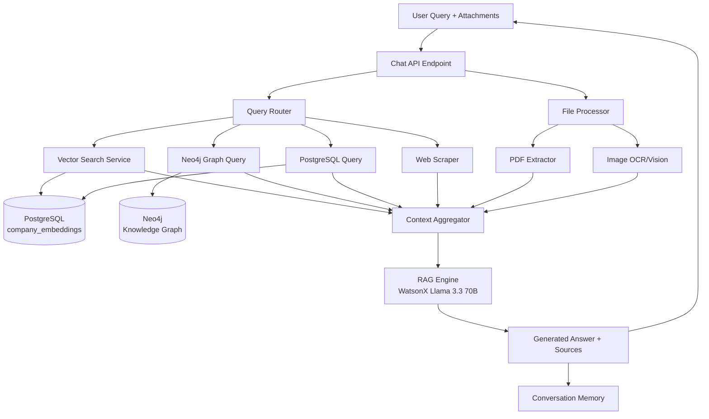

# RAG AI Agent - Complete Implementation Guide

## Table of Contents
1. [Overview](#overview)
2. [Architecture](#architecture)
3. [Implementation Steps](#implementation-steps)
4. [Technical Specifications](#technical-specifications)
5. [Testing & Deployment](#testing--deployment)
6. [Success Metrics](#success-metrics)

---

## Overview

A Retrieval-Augmented Generation (RAG) AI Agent that connects to the chatbot interface, providing intelligent responses by:
- Querying Neo4j and PostgreSQL databases for context
- Processing PDFs and images with OCR and vision analysis
- Enriching answers with web-scraped data when needed
- Maintaining conversation history and context
- Citing sources for all factual claims

**Estimated Implementation Time**: 12-18 days

---

## Architecture



### Core Components

1. **RAG Query Engine** - Main orchestrator
2. **Vector Search Service** - Semantic search across embeddings
3. **Context Retriever** - Fetch data from Neo4j + PostgreSQL
4. **File Processor** - PDF/image extraction and analysis
5. **Web Scraper** - External data enrichment
6. **Conversation Memory** - Chat history management
7. **Chat API** - FastAPI endpoints with streaming

---

## Implementation Steps

### Phase 1: Foundation & Database Setup

#### Step 1: Create Database Schema
**File**: `src/database/migrations/add_rag_tables.sql`

```sql
-- Conversations metadata table (NEW)
CREATE TABLE IF NOT EXISTS conversations (
    id UUID PRIMARY KEY DEFAULT gen_random_uuid(),
    owner_clerk_id TEXT NOT NULL,
    title TEXT NOT NULL,
    created_at TIMESTAMP DEFAULT NOW(),
    updated_at TIMESTAMP DEFAULT NOW(),
    message_count INTEGER DEFAULT 0,
    is_archived BOOLEAN DEFAULT FALSE
);

CREATE INDEX IF NOT EXISTS idx_conversations ON conversations(owner_clerk_id, updated_at DESC);
CREATE INDEX IF NOT EXISTS idx_conversations_active ON conversations(owner_clerk_id, is_archived) WHERE is_archived = FALSE;

-- Conversation history (messages within each conversation)
CREATE TABLE IF NOT EXISTS conversation_history (
    id UUID PRIMARY KEY DEFAULT gen_random_uuid(),
    owner_clerk_id TEXT NOT NULL,
    conversation_id UUID NOT NULL REFERENCES conversations(id) ON DELETE CASCADE,
    role TEXT NOT NULL CHECK (role IN ('user', 'assistant')),
    content TEXT NOT NULL,
    attachments JSONB,
    sources JSONB,
    created_at TIMESTAMP DEFAULT NOW()
);

CREATE INDEX IF NOT EXISTS idx_conv_history ON conversation_history(owner_clerk_id, conversation_id, created_at DESC);

-- Trigger to update conversation metadata
CREATE OR REPLACE FUNCTION update_conversation_metadata()
RETURNS TRIGGER AS $$
BEGIN
    UPDATE conversations
    SET updated_at = NOW(),
        message_count = message_count + 1
    WHERE id = NEW.conversation_id;
    RETURN NEW;
END;
$$ LANGUAGE plpgsql;

CREATE TRIGGER trigger_update_conversation
AFTER INSERT ON conversation_history
FOR EACH ROW
EXECUTE FUNCTION update_conversation_metadata();

-- Document embeddings for uploaded files
CREATE TABLE IF NOT EXISTS document_embeddings (
    id UUID PRIMARY KEY DEFAULT gen_random_uuid(),
    owner_clerk_id TEXT NOT NULL,
    conversation_id UUID,
    filename TEXT NOT NULL,
    file_type TEXT NOT NULL,
    chunk_index INTEGER NOT NULL,
    content TEXT NOT NULL,
    embedding vector(768),
    created_at TIMESTAMP DEFAULT NOW()
);

CREATE INDEX IF NOT EXISTS idx_doc_embeddings ON document_embeddings(owner_clerk_id, conversation_id);

-- Web scraping cache
CREATE TABLE IF NOT EXISTS web_scrape_cache (
    id UUID PRIMARY KEY DEFAULT gen_random_uuid(),
    url TEXT NOT NULL,
    content TEXT NOT NULL,
    metadata JSONB,
    scraped_at TIMESTAMP DEFAULT NOW(),
    expires_at TIMESTAMP,
    UNIQUE(url)
);

CREATE INDEX IF NOT EXISTS idx_scrape_cache ON web_scrape_cache(url, expires_at);
```

**Action**: Run migration with `psql $POSTGRES_URL -f src/database/migrations/add_rag_tables.sql`

---

#### Step 2: Update Configuration
**File**: `src/config.py`

Add to the `Settings` class:

```python
# RAG Configuration
rag_max_context_tokens: int = 8000
rag_top_k_companies: int = 5
rag_similarity_threshold: float = 0.7
rag_conversation_window: int = 10
rag_enable_web_scraping: bool = True
rag_scraping_timeout: int = 30
rag_cache_ttl: int = 86400  # 24 hours

# File Processing
max_file_size_mb: int = 20
allowed_file_types: str = "pdf,png,jpg,jpeg,webp,gif,doc,docx,txt,md"
```

---

#### Step 3: Install Dependencies
**File**: `requirements.txt`

Add these lines:

```txt
# PDF Processing
PyPDF2==3.0.1
pdfplumber==0.10.3

# Image Processing
pytesseract==0.3.10
Pillow==10.2.0

# Web Scraping
beautifulsoup4==4.12.3
playwright==1.41.0
lxml==5.1.0

# Utilities
aiofiles==23.2.1
python-multipart==0.0.6
```

**Actions**:
```bash
pip install -r requirements.txt
playwright install

# Install system dependencies for OCR
# Ubuntu/Debian: sudo apt-get install tesseract-ocr
# macOS: brew install tesseract
# Windows: Download from https://github.com/UB-Mannheim/tesseract/wiki
```

---

### Phase 2: Core RAG Components (Days 1-4)

#### Step 4: Vector Search Service
**File**: `src/rag/vector_search.py`

**Purpose**: Semantic search across company embeddings

**Key Functions**:
```python
async def search_similar_companies(
    query: str, 
    clerk_id: str, 
    top_k: int = 5
) -> List[Dict]:
    """
    1. Generate query embedding using WatsonX Granite
    2. Search company_embeddings table with cosine similarity
    3. Return ranked companies with scores
    """
```

**Implementation Notes**:
- Leverage existing `company_embeddings` table (768-dim vectors)
- Use pgvector's cosine similarity operator `<=>`
- Filter by `owner_clerk_id` for multi-tenant isolation
- Return company_id, similarity_score, embedding_text

---

#### Step 5: Context Retriever
**File**: `src/rag/context_retriever.py`

**Purpose**: Fetch relevant context from Neo4j and PostgreSQL

**Key Functions**:
```python
async def get_company_context(company_id: str, clerk_id: str) -> Dict
async def get_interaction_context(company_ids: List[str], clerk_id: str) -> List[Dict]
async def get_relationship_context(company_ids: List[str], clerk_id: str) -> Dict
async def aggregate_context(contexts: List[Dict]) -> str
```

**Context Types Retrieved**:
- Company profiles (name, sector, stage, verdict)
- Recent interactions with summaries
- People/contacts (founders, team members)
- Similar companies and relationships
- Team debates and decision records
- Market map clusters

**Neo4j Queries**:
```cypher
// Get company with relationships
MATCH (c:Company {clerk_id: $clerk_id, id: $company_id})
OPTIONAL MATCH (c)-[:HAS_INTERACTION]->(i:Interaction)
OPTIONAL MATCH (c)-[:HAS_CONTACT]->(p:Person)
OPTIONAL MATCH (c)-[:SIMILAR_TO]->(similar:Company)
RETURN c, collect(i), collect(p), collect(similar)
```

**PostgreSQL Queries**:
```sql
-- Get interaction content
SELECT i.*, ic.content, ic.summary
FROM interactions i
JOIN interaction_content ic ON i.id = ic.interaction_id
WHERE i.company_id = ANY($company_ids)
  AND i.owner_clerk_id = $clerk_id
ORDER BY i.interaction_date DESC
LIMIT 10;
```

---

#### Step 6: RAG Query Engine
**File**: `src/rag/query_engine.py`

**Purpose**: Main orchestrator that ties everything together

**Key Class**: `RAGQueryEngine`

**Methods**:
```python
async def query(
    user_query: str,
    clerk_id: str,
    conversation_history: List[Message],
    attachments: List[Attachment] = None
) -> RAGResponse:
    """
    1. Classify query type
    2. Generate query embedding
    3. Search similar companies (vector search)
    4. Retrieve detailed context (Neo4j + PostgreSQL)
    5. Process attachments if any
    6. Check if web scraping needed
    7. Build prompt with all context
    8. Call WatsonX Llama 3.3 70B
    9. Extract sources from response
    10. Return answer with citations
    """

async def _classify_query(query: str) -> List[str]:
    """Classify into: company_search, interaction_summary, 
    decision_support, market_analysis, document_analysis, 
    external_research, general_question"""

async def _retrieve_context(query: str, clerk_id: str) -> str:
    """Orchestrate vector search + context retrieval"""

async def _generate_response(
    query: str, 
    context: str, 
    history: List
) -> str:
    """Call WatsonX with constructed prompt"""

async def _extract_sources(
    context: str, 
    response: str
) -> List[Source]:
    """Parse response for source citations"""
```

**Query Flow**:
1. User submits query (+ optional files)
2. Classify query to determine data sources needed
3. Vector search finds relevant companies
4. Context retriever fetches detailed information
5. File processor extracts text from attachments
6. Web scraper enriches with external data (if needed)
7. Aggregate all context into structured format
8. Build prompt with context + conversation history
9. Call WatsonX Llama 3.3 70B for generation
10. Parse response and extract source citations
11. Save to conversation history
12. Return answer with sources

---

#### Step 7: Prompt Templates
**File**: `src/rag/prompts/system_prompt.txt`

```
You are Yellow Copilot, an AI assistant for venture capital deal flow management.

You have access to a comprehensive knowledge base including:
- Company profiles and interactions from the knowledge graph
- Team discussions and investment decisions
- Market maps and clustering data
- Uploaded documents and images
- Real-time web data when needed

Your responsibilities:
1. Answer questions accurately using ONLY the provided context
2. Cite sources for ALL factual claims using [Source: Company Name, Date]
3. Admit when you don't have enough information
4. Suggest 2-3 relevant follow-up questions
5. Maintain conversation context across messages

Context:
{context}

Conversation History:
{history}

User Query: {query}

Instructions:
- Use ONLY the context above to answer
- Cite sources for every factual claim
- If context is insufficient, say so clearly and suggest what data might help
- Be concise but comprehensive
- Format responses in markdown
- End with 2-3 suggested follow-up questions
```

**File**: `src/rag/prompts/query_classifier.txt`

```
Classify the user query into one or more categories:

Categories:
- company_search: Looking for specific companies
- interaction_summary: Summarizing meetings/emails
- decision_support: Helping with investment decisions
- market_analysis: Market trends and clusters
- document_analysis: Analyzing uploaded files
- external_research: Needs web scraping
- general_question: General VC/startup questions

Query: {user_query}

Return JSON: {"categories": ["category1", "category2"], "confidence": 0.95}
```

---

### Phase 3: File Processing (Days 5-7)

#### Step 8: File Processor
**File**: `src/rag/file_processor.py`

**Purpose**: Extract text and insights from uploaded files

**Key Class**: `FileProcessor`

**Methods**:
```python
async def process_pdf(
    file: UploadFile, 
    clerk_id: str, 
    conversation_id: str
) -> List[str]:
    """
    1. Validate file type and size
    2. Extract text using PyPDF2/pdfplumber
    3. Handle scanned PDFs with OCR
    4. Chunk large documents (1000 chars per chunk)
    5. Generate embeddings for each chunk
    6. Store in document_embeddings table
    7. Return extracted text for immediate use
    """

async def process_image(
    file: UploadFile, 
    clerk_id: str, 
    conversation_id: str
) -> str:
    """
    1. Validate image format
    2. OCR text extraction using pytesseract
    3. Image analysis using WatsonX vision (if available)
    4. Extract structured data
    5. Store embedding
    6. Return extracted text
    """

async def extract_text_from_pdf(file_path: str) -> str
async def ocr_image(file_path: str) -> str
async def chunk_text(text: str, chunk_size: int = 1000) -> List[str]
async def embed_and_store(chunks: List[str], metadata: Dict) -> None
```

**Supported Formats**:
- PDFs (text extraction + OCR for scanned docs)
- Images (PNG, JPEG, WebP, GIF)
- Documents (DOC, DOCX, TXT, MD)

**Processing Steps**:
1. Validate file type against allowed list
2. Check file size (max 20MB)
3. Save to temporary location
4. Extract text based on file type
5. Chunk if needed (large documents)
6. Generate embeddings using WatsonX Granite
7. Store in `document_embeddings` table
8. Clean up temporary files
9. Return extracted text

---

### Phase 4: Web Scraping (Days 8-10)

#### Step 9: Web Scraper
**File**: `src/rag/web_scraper.py`

**Purpose**: Enrich answers with external data when needed

**Key Class**: `WebScraper`

**Methods**:
```python
async def scrape_url(url: str) -> Dict:
    """
    1. Check cache first
    2. Validate URL and check robots.txt
    3. Fetch HTML with rate limiting
    4. Extract main content
    5. Cache result with TTL
    6. Return structured data
    """

async def search_and_scrape(query: str, max_results: int = 3) -> List[Dict]:
    """
    1. Perform web search (Google/Bing API)
    2. Scrape top results
    3. Extract relevant information
    4. Return aggregated data
    """

async def extract_content(html: str) -> str:
    """Extract main content from HTML using BeautifulSoup"""

async def cache_result(url: str, content: str, ttl: int) -> None:
    """Store in web_scrape_cache table"""

async def get_cached(url: str) -> Optional[Dict]:
    """Retrieve from cache if not expired"""
```

**Features**:
- Respect robots.txt
- Rate limiting (0.5s between requests)
- Caching with 24h TTL
- Error handling and retries
- Content extraction from HTML
- Structured data extraction

**Use Cases**:
- Company news and updates
- Market research and trends
- Competitor analysis
- Industry reports
- Funding announcements

**When to Trigger**:
- Query classified as "external_research"
- Company not in database
- Recent news requested
- Market trends query
- Competitor information needed

---

### Phase 5: Conversation Management (Days 11-13)

#### Step 10: Conversation Memory
**File**: `src/rag/conversation_memory.py`

**Purpose**: Manage chat conversations with isolated context per chat

**Key Class**: `ConversationMemory`

**Methods**:
```python
async def create_conversation(
    clerk_id: str,
    title: str = "New Chat"
) -> str:
    """
    Create new conversation with title
    - Generates UUID for conversation_id
    - Stores in conversations table
    - Returns conversation_id
    """

async def list_conversations(
    clerk_id: str,
    include_archived: bool = False,
    limit: int = 50
) -> List[Dict]:
    """
    List all conversations for user
    - Returns: id, title, created_at, updated_at, message_count
    - Ordered by updated_at DESC (most recent first)
    - Can filter out archived conversations
    """

async def get_conversation(
    clerk_id: str,
    conversation_id: str
) -> Optional[Dict]:
    """Get conversation metadata by ID"""

async def update_conversation_title(
    clerk_id: str,
    conversation_id: str,
    title: str
) -> bool:
    """Update conversation title"""

async def archive_conversation(
    clerk_id: str,
    conversation_id: str
) -> bool:
    """Archive conversation (soft delete)"""

async def delete_conversation(
    clerk_id: str,
    conversation_id: str
) -> bool:
    """
    Permanently delete conversation and all messages
    - CASCADE DELETE removes all messages automatically
    """

async def save_message(
    clerk_id: str,
    conversation_id: str,
    role: str,
    content: str,
    sources: List[Source] = None,
    attachments: List[str] = None
) -> None:
    """
    Store message in conversation_history table
    - Automatically updates conversation metadata via trigger
    """

async def get_history(
    clerk_id: str,
    conversation_id: str,
    limit: int = 10
) -> List[Dict]:
    """
    Retrieve last N messages from THIS conversation only
    - Each conversation has isolated context
    - Returns messages in chronological order
    - Used as context for RAG queries
    """

async def format_history_for_prompt(
    history: List[Dict],
    max_tokens: int = 2000
) -> str:
    """
    Format conversation history for LLM prompt
    - Truncates if exceeds max_tokens
    - Keeps most recent messages
    - Formats as: "User: ...\nAssistant: ..."
    """

async def generate_conversation_title(
    clerk_id: str,
    conversation_id: str,
    first_message: str
) -> str:
    """
    Auto-generate conversation title from first message
    - Uses LLM to create concise title (3-5 words)
    - Falls back to truncated first message
    - Updates conversation title automatically
    """
```

**Key Features**:
- ✅ Each conversation has unique ID and title
- ✅ Isolated context per conversation
- ✅ Conversation list with metadata
- ✅ Auto-generated titles from first message
- ✅ Soft delete (archive) and hard delete
- ✅ Message count tracking
- ✅ Last updated timestamp
- ✅ Multi-tenant isolation (clerk_id)
- ✅ Sliding window for token management
- ✅ CASCADE DELETE for cleanup

**Context Isolation**:
When a user queries in a specific conversation, the RAG system ONLY uses:
1. Messages from THAT conversation (not other chats)
2. Database context (companies, interactions)
3. Uploaded files in THAT conversation
4. Web-scraped data (if needed)

This ensures each chat maintains its own context and doesn't leak information between conversations.

---

#### Step 11: Chat API Endpoints
**File**: `src/api/chat.py`

**Purpose**: FastAPI endpoints for chatbot interactions

**Endpoints**:

```python
from fastapi import APIRouter, Depends, UploadFile, File, Form
from src.api.auth import get_current_user_provisioned, ClerkUser

router = APIRouter(prefix="/chat", tags=["chat"])

@router.post("/query")
async def chat_query(
    request: ChatRequest,
    user: ClerkUser = Depends(get_current_user_provisioned)
) -> ChatResponse:
    """
    Main chat endpoint
    - Accepts query + conversation_id + optional attachments
    - Uses ONLY that conversation's history as context
    - Returns answer with sources and suggested follow-ups
    """

@router.post("/upload")
async def upload_file(
    file: UploadFile = File(...),
    conversation_id: str = Form(...),
    user: ClerkUser = Depends(get_current_user_provisioned)
) -> FileUploadResponse:
    """
    File upload endpoint
    - Validates file type and size
    - Processes file (PDF/image)
    - Associates file with specific conversation
    - Returns file_id for use in queries
    """

# Conversation Management Endpoints

@router.get("/conversations")
async def list_conversations(
    include_archived: bool = False,
    limit: int = 50,
    user: ClerkUser = Depends(get_current_user_provisioned)
) -> ConversationsListResponse:
    """
    List all user's conversations
    - Returns: id, title, created_at, updated_at, message_count
    - Ordered by most recent first
    - Can include archived conversations
    """

@router.post("/conversations")
async def create_conversation(
    request: CreateConversationRequest,
    user: ClerkUser = Depends(get_current_user_provisioned)
) -> NewConversationResponse:
    """
    Create new conversation
    - Optional: provide initial title
    - Default: "New Chat" (auto-generated after first message)
    - Returns conversation_id
    """

@router.get("/conversations/{conversation_id}")
async def get_conversation(
    conversation_id: str,
    user: ClerkUser = Depends(get_current_user_provisioned)
) -> ConversationResponse:
    """Get conversation metadata"""

@router.patch("/conversations/{conversation_id}")
async def update_conversation(
    conversation_id: str,
    request: UpdateConversationRequest,
    user: ClerkUser = Depends(get_current_user_provisioned)
) -> ConversationResponse:
    """
    Update conversation
    - Can update: title
    - Returns updated conversation
    """

@router.get("/conversations/{conversation_id}/history")
async def get_conversation_history(
    conversation_id: str,
    limit: int = 50,
    user: ClerkUser = Depends(get_current_user_provisioned)
) -> ConversationHistoryResponse:
    """
    Get conversation message history
    - Returns all messages in chronological order
    - Can limit number of messages
    """

@router.post("/conversations/{conversation_id}/archive")
async def archive_conversation(
    conversation_id: str,
    user: ClerkUser = Depends(get_current_user_provisioned)
) -> SuccessResponse:
    """Archive conversation (soft delete)"""

@router.delete("/conversations/{conversation_id}")
async def delete_conversation(
    conversation_id: str,
    user: ClerkUser = Depends(get_current_user_provisioned)
) -> SuccessResponse:
    """Permanently delete conversation and all messages"""
```

**Request/Response Models**:

```python
from pydantic import BaseModel, Field
from typing import List, Optional
from datetime import datetime

class ChatRequest(BaseModel):
    query: str
    conversation_id: str  # REQUIRED - must specify which conversation
    attachments: Optional[List[str]] = None

class Source(BaseModel):
    type: str  # 'company', 'interaction', 'document', 'web'
    id: str
    title: str
    excerpt: str
    url: Optional[str] = None
    relevance_score: float

class ChatResponse(BaseModel):
    answer: str
    sources: List[Source]
    conversation_id: str
    suggested_followups: List[str]

class FileUploadResponse(BaseModel):
    file_id: str
    filename: str
    file_type: str
    size_bytes: int
    processed: bool
    conversation_id: str

# Conversation Management Models

class CreateConversationRequest(BaseModel):
    title: Optional[str] = "New Chat"

class UpdateConversationRequest(BaseModel):
    title: str

class ConversationMetadata(BaseModel):
    id: str
    title: str
    created_at: datetime
    updated_at: datetime
    message_count: int
    is_archived: bool

class NewConversationResponse(BaseModel):
    conversation_id: str
    title: str
    created_at: datetime

class ConversationResponse(BaseModel):
    conversation: ConversationMetadata

class ConversationsListResponse(BaseModel):
    conversations: List[ConversationMetadata]
    total: int

class Message(BaseModel):
    id: str
    role: str
    content: str
    sources: Optional[List[Source]] = None
    attachments: Optional[List[str]] = None
    created_at: datetime

class ConversationHistoryResponse(BaseModel):
    conversation_id: str
    messages: List[Message]
    total: int

class SuccessResponse(BaseModel):
    success: bool
    message: str
```

---

#### Step 12: Streaming Support (Optional but Recommended)
**File**: `src/api/chat.py` (add streaming endpoint)

```python
from fastapi.responses import StreamingResponse
import json

@router.post("/stream")
async def chat_stream(
    request: ChatRequest,
    user: ClerkUser = Depends(get_current_user_provisioned)
):
    """
    Streaming chat endpoint using Server-Sent Events (SSE)
    - Streams response chunks as they're generated
    - Better UX for long responses
    """
    async def generate():
        try:
            async for chunk in rag_engine.stream_query(
                query=request.query,
                clerk_id=user.clerk_id,
                conversation_id=request.conversation_id,
                attachments=request.attachments
            ):
                yield f"data: {json.dumps(chunk)}\n\n"
        except Exception as e:
            yield f"data: {json.dumps({'error': str(e)})}\n\n"
    
    return StreamingResponse(
        generate(),
        media_type="text/event-stream"
    )
```

---

### Phase 6: Frontend Integration (Days 14-16)

#### Step 13: Update API Client
**File**: `frontend/lib/api.ts`

Add chat API methods:

```typescript
// Types
export interface ChatResponse {
  answer: string;
  sources: Source[];
  conversation_id: string;
  suggested_followups: string[];
}

export interface Source {
  type: 'company' | 'interaction' | 'document' | 'web';
  id: string;
  title: string;
  excerpt: string;
  url?: string;
  relevance_score: number;
}

export interface ConversationMetadata {
  id: string;
  title: string;
  created_at: string;
  updated_at: string;
  message_count: number;
  is_archived: boolean;
}

export interface Message {
  id: string;
  role: 'user' | 'assistant';
  content: string;
  sources?: Source[];
  attachments?: string[];
  created_at: string;
}

// Chat API Methods

export async function sendChatMessage(
  query: string,
  conversationId: string,  // REQUIRED
  attachments?: string[]
): Promise<ChatResponse> {
  const response = await fetch(`${API_BASE_URL}/chat/query`, {
    method: 'POST',
    headers: {
      'Content-Type': 'application/json',
      'Authorization': `Bearer ${await getToken()}`,
    },
    body: JSON.stringify({
      query,
      conversation_id: conversationId,
      attachments
    }),
  });
  
  if (!response.ok) {
    throw new Error(`Chat API error: ${response.statusText}`);
  }
  
  return response.json();
}

export async function uploadFile(
  file: File,
  conversationId: string
): Promise<{ file_id: string }> {
  const formData = new FormData();
  formData.append('file', file);
  formData.append('conversation_id', conversationId);

  const response = await fetch(`${API_BASE_URL}/chat/upload`, {
    method: 'POST',
    headers: {
      'Authorization': `Bearer ${await getToken()}`,
    },
    body: formData,
  });
  
  if (!response.ok) {
    throw new Error(`File upload error: ${response.statusText}`);
  }
  
  return response.json();
}

// Conversation Management API Methods

export async function listConversations(
  includeArchived: boolean = false,
  limit: number = 50
): Promise<ConversationMetadata[]> {
  const params = new URLSearchParams({
    include_archived: includeArchived.toString(),
    limit: limit.toString(),
  });
  
  const response = await fetch(
    `${API_BASE_URL}/chat/conversations?${params}`,
    {
      headers: {
        'Authorization': `Bearer ${await getToken()}`,
      },
    }
  );
  
  if (!response.ok) {
    throw new Error(`List conversations error: ${response.statusText}`);
  }
  
  const data = await response.json();
  return data.conversations;
}

export async function createConversation(
  title: string = "New Chat"
): Promise<{ conversation_id: string; title: string }> {
  const response = await fetch(`${API_BASE_URL}/chat/conversations`, {
    method: 'POST',
    headers: {
      'Content-Type': 'application/json',
      'Authorization': `Bearer ${await getToken()}`,
    },
    body: JSON.stringify({ title }),
  });
  
  if (!response.ok) {
    throw new Error(`Create conversation error: ${response.statusText}`);
  }
  
  return response.json();
}

export async function getConversation(
  conversationId: string
): Promise<ConversationMetadata> {
  const response = await fetch(
    `${API_BASE_URL}/chat/conversations/${conversationId}`,
    {
      headers: {
        'Authorization': `Bearer ${await getToken()}`,
      },
    }
  );
  
  if (!response.ok) {
    throw new Error(`Get conversation error: ${response.statusText}`);
  }
  
  const data = await response.json();
  return data.conversation;
}

export async function updateConversationTitle(
  conversationId: string,
  title: string
): Promise<ConversationMetadata> {
  const response = await fetch(
    `${API_BASE_URL}/chat/conversations/${conversationId}`,
    {
      method: 'PATCH',
      headers: {
        'Content-Type': 'application/json',
        'Authorization': `Bearer ${await getToken()}`,
      },
      body: JSON.stringify({ title }),
    }
  );
  
  if (!response.ok) {
    throw new Error(`Update conversation error: ${response.statusText}`);
  }
  
  const data = await response.json();
  return data.conversation;
}

export async function getConversationHistory(
  conversationId: string,
  limit: number = 50
): Promise<Message[]> {
  const response = await fetch(
    `${API_BASE_URL}/chat/conversations/${conversationId}/history?limit=${limit}`,
    {
      headers: {
        'Authorization': `Bearer ${await getToken()}`,
      },
    }
  );
  
  if (!response.ok) {
    throw new Error(`Get history error: ${response.statusText}`);
  }
  
  const data = await response.json();
  return data.messages;
}

export async function archiveConversation(
  conversationId: string
): Promise<void> {
  const response = await fetch(
    `${API_BASE_URL}/chat/conversations/${conversationId}/archive`,
    {
      method: 'POST',
      headers: {
        'Authorization': `Bearer ${await getToken()}`,
      },
    }
  );
  
  if (!response.ok) {
    throw new Error(`Archive conversation error: ${response.statusText}`);
  }
}

export async function deleteConversation(
  conversationId: string
): Promise<void> {
  const response = await fetch(
    `${API_BASE_URL}/chat/conversations/${conversationId}`,
    {
      method: 'DELETE',
      headers: {
        'Authorization': `Bearer ${await getToken()}`,
      },
    }
  );
  
  if (!response.ok) {
    throw new Error(`Delete conversation error: ${response.statusText}`);
  }
}
```

---

#### Step 14: Update Chatbot Page
**File**: `frontend/app/(app)/chatbot/page.tsx`

Replace mock implementation with real API calls and add conversation management:

```typescript
'use client';

import { useState, useEffect } from 'react';
import {
  listConversations,
  createConversation,
  sendChatMessage,
  uploadFile,
  getConversationHistory,
  deleteConversation,
  updateConversationTitle,
  type ConversationMetadata
} from '@/lib/api';

export default function ChatbotPage() {
  // State
  const [conversations, setConversations] = useState<ConversationMetadata[]>([]);
  const [currentConversationId, setCurrentConversationId] = useState<string | null>(null);
  const [messages, setMessages] = useState<ChatMessage[]>([]);
  const [input, setInput] = useState('');
  const [attachments, setAttachments] = useState<File[]>([]);
  const [pending, setPending] = useState(false);
  const [showSidebar, setShowSidebar] = useState(true);

  // Load conversations on mount
  useEffect(() => {
    loadConversations();
  }, []);

  // Load conversation history when switching conversations
  useEffect(() => {
    if (currentConversationId) {
      loadConversationHistory(currentConversationId);
    }
  }, [currentConversationId]);

  async function loadConversations() {
    try {
      const convs = await listConversations();
      setConversations(convs);
      
      // If no current conversation, select the most recent one
      if (!currentConversationId && convs.length > 0) {
        setCurrentConversationId(convs[0].id);
      }
    } catch (error) {
      console.error('Failed to load conversations:', error);
    }
  }

  async function loadConversationHistory(conversationId: string) {
    try {
      const history = await getConversationHistory(conversationId);
      setMessages(history.map(msg => ({
        id: msg.id,
        role: msg.role,
        text: msg.content,
        ts: new Date(msg.created_at).getTime(),
        sources: msg.sources,
        attachments: msg.attachments,
      })));
    } catch (error) {
      console.error('Failed to load conversation history:', error);
      setMessages([]);
    }
  }

  async function handleNewConversation() {
    try {
      const { conversation_id } = await createConversation();
      setCurrentConversationId(conversation_id);
      setMessages([]);
      await loadConversations(); // Refresh list
    } catch (error) {
      console.error('Failed to create conversation:', error);
    }
  }

  async function handleDeleteConversation(conversationId: string) {
    if (!confirm('Are you sure you want to delete this conversation?')) return;
    
    try {
      await deleteConversation(conversationId);
      
      // If deleting current conversation, switch to another
      if (conversationId === currentConversationId) {
        const remaining = conversations.filter(c => c.id !== conversationId);
        setCurrentConversationId(remaining[0]?.id || null);
        setMessages([]);
      }
      
      await loadConversations();
    } catch (error) {
      console.error('Failed to delete conversation:', error);
    }
  }

  async function handleRenameConversation(conversationId: string, newTitle: string) {
    try {
      await updateConversationTitle(conversationId, newTitle);
      await loadConversations();
    } catch (error) {
      console.error('Failed to rename conversation:', error);
    }
  }

  async function send(text: string) {
    const trimmed = text.trim();
    if ((!trimmed && attachments.length === 0) || pending) return;
    
    // Must have a conversation selected
    if (!currentConversationId) {
      await handleNewConversation();
      return;
    }

    const userMsg: ChatMessage = {
      id: `u-${Date.now()}`,
      role: "user",
      text: trimmed,
      ts: Date.now(),
      attachments: attachments.length ? attachments : undefined,
    };
    
    setMessages((prev) => [...prev, userMsg]);
    setInput("");
    setAttachments([]);
    setPending(true);

    try {
      // Upload files first if any
      const uploadedIds: string[] = [];
      for (const file of attachments) {
        const result = await uploadFile(file, currentConversationId);
        uploadedIds.push(result.file_id);
      }

      // Send query to RAG API with current conversation context
      const response = await sendChatMessage(
        trimmed,
        currentConversationId,
        uploadedIds.length ? uploadedIds : undefined
      );

      // Create assistant message with sources
      const reply: ChatMessage = {
        id: `a-${Date.now()}`,
        role: "assistant",
        text: response.answer,
        ts: Date.now(),
        sources: response.sources,
        suggestedFollowups: response.suggested_followups,
      };
      
      setMessages((prev) => [...prev, reply]);
      
      // Refresh conversations list to update message count and timestamp
      await loadConversations();
    } catch (error) {
      console.error("Chat error:", error);
      
      // Show error message
      const errorMsg: ChatMessage = {
        id: `e-${Date.now()}`,
        role: "assistant",
        text: "Sorry, I encountered an error processing your request. Please try again.",
        ts: Date.now(),
      };
      setMessages((prev) => [...prev, errorMsg]);
    } finally {
      setPending(false);
    }
  }

  return (
    <div className="flex h-screen">
      {/* Sidebar with conversation list */}
      {showSidebar && (
        <div className="w-64 border-r border-line bg-bg-subtle p-4 flex flex-col">
          <button
            onClick={handleNewConversation}
            className="mb-4 px-4 py-2 bg-blue-500 text-white rounded-lg hover:bg-blue-600"
          >
            + New Chat
          </button>
          
          <div className="flex-1 overflow-y-auto space-y-2">
            {conversations.map((conv) => (
              <div
                key={conv.id}
                className={`p-3 rounded-lg cursor-pointer hover:bg-bg-hover ${
                  conv.id === currentConversationId ? 'bg-bg-hover border border-blue-500' : ''
                }`}
                onClick={() => setCurrentConversationId(conv.id)}
              >
                <div className="font-medium text-sm truncate">{conv.title}</div>
                <div className="text-xs text-ink-faint mt-1">
                  {conv.message_count} messages
                </div>
                <div className="flex gap-2 mt-2">
                  <button
                    onClick={(e) => {
                      e.stopPropagation();
                      const newTitle = prompt('New title:', conv.title);
                      if (newTitle) handleRenameConversation(conv.id, newTitle);
                    }}
                    className="text-xs text-blue-500 hover:underline"
                  >
                    Rename
                  </button>
                  <button
                    onClick={(e) => {
                      e.stopPropagation();
                      handleDeleteConversation(conv.id);
                    }}
                    className="text-xs text-red-500 hover:underline"
                  >
                    Delete
                  </button>
                </div>
              </div>
            ))}
          </div>
        </div>
      )}

      {/* Main chat area */}
      <div className="flex-1 flex flex-col">
        {/* Chat messages */}
        <div className="flex-1 overflow-y-auto p-4">
          {messages.map((msg) => (
            <div key={msg.id} className="mb-4">
              <div className={`font-medium text-sm mb-1 ${
                msg.role === 'user' ? 'text-blue-500' : 'text-green-500'
              }`}>
                {msg.role === 'user' ? 'You' : 'Assistant'}
              </div>
              <div className="text-ink">{msg.text}</div>
              {msg.sources && <SourceCitation sources={msg.sources} />}
            </div>
          ))}
        </div>

        {/* Input area */}
        <div className="border-t border-line p-4">
          <textarea
            value={input}
            onChange={(e) => setInput(e.target.value)}
            onKeyDown={(e) => {
              if (e.key === 'Enter' && !e.shiftKey) {
                e.preventDefault();
                send(input);
              }
            }}
            placeholder="Ask anything about your deal flow..."
            className="w-full p-3 border border-line rounded-lg resize-none"
            rows={3}
            disabled={pending}
          />
          <div className="flex justify-between items-center mt-2">
            <input
              type="file"
              multiple
              onChange={(e) => setAttachments(Array.from(e.target.files || []))}
              className="text-sm"
            />
            <button
              onClick={() => send(input)}
              disabled={pending || (!input.trim() && attachments.length === 0)}
              className="px-4 py-2 bg-blue-500 text-white rounded-lg hover:bg-blue-600 disabled:opacity-50"
            >
              {pending ? 'Sending...' : 'Send'}
            </button>
          </div>
        </div>
      </div>
    </div>
  );
}
```

**Key Features Added**:
- ✅ Sidebar with conversation list
- ✅ Create new conversation button
- ✅ Switch between conversations
- ✅ Rename conversations
- ✅ Delete conversations
- ✅ Each conversation loads its own history
- ✅ Message count display
- ✅ Current conversation highlighting
- ✅ Isolated context per conversation

---

#### Step 15: Add Source Citations UI
**File**: `frontend/components/source-citation.tsx`

Create component to display sources:

```typescript
import { Source } from '@/lib/api';

interface SourceCitationProps {
  sources: Source[];
}

export function SourceCitation({ sources }: SourceCitationProps) {
  if (!sources || sources.length === 0) return null;

  return (
    <div className="mt-3 space-y-2">
      <div className="text-xs font-medium text-ink-muted">Sources:</div>
      {sources.map((source, idx) => (
        <div 
          key={idx} 
          className="text-xs bg-bg-subtle border border-line rounded-lg p-3 hover:bg-bg-hover transition-colors"
        >
          <div className="flex items-start justify-between gap-2">
            <div className="flex-1">
              <div className="font-medium text-ink flex items-center gap-2">
                {getSourceIcon(source.type)}
                {source.title}
              </div>
              <div className="text-ink-faint mt-1 line-clamp-2">
                {source.excerpt}
              </div>
              {source.url && (
                <a 
                  href={source.url} 
                  target="_blank"
                  rel="noopener noreferrer"
                  className="text-blue-500 hover:underline mt-1 inline-block text-xs"
                >
                  View source →
                </a>
              )}
            </div>
            <div className="text-xs text-ink-faint">
              {Math.round(source.relevance_score * 100)}% match
            </div>
          </div>
        </div>
      ))}
    </div>
  );
}

function getSourceIcon(type: string) {
  switch (type) {
    case 'company': return '🏢';
    case 'interaction': return '💬';
    case 'document': return '📄';
    case 'web': return '🌐';
    default: return '📌';
  }
}
```

Update chatbot page to use it:

```typescript
import { SourceCitation } from '@/components/source-citation';

// In message rendering:
{msg.role === "assistant" && msg.sources && (
  <SourceCitation sources={msg.sources} />
)}
```

---

### Phase 7: Testing & Deployment (Days 17-18)

#### Step 16: Create Test Suite
**File**: `tests/test_rag.py`

```python
import pytest
from src.rag.vector_search import search_similar_companies
from src.rag.context_retriever import get_company_context
from src.rag.query_engine import RAGQueryEngine
from src.rag.file_processor import FileProcessor
from src.rag.web_scraper import WebScraper
from src.rag.conversation_memory import ConversationMemory

@pytest.mark.asyncio
async def test_vector_search():
    """Test semantic search returns relevant companies"""
    results = await search_similar_companies(
        query="AI startups in healthcare",
        clerk_id="test_user",
        top_k=5
    )
    assert len(results) <= 5
    assert all('similarity_score' in r for r in results)

@pytest.mark.asyncio
async def test_context_retrieval():
    """Test context retrieval from databases"""
    context = await get_company_context(
        company_id="test_company",
        clerk_id="test_user"
    )
    assert 'company' in context
    assert 'interactions' in context

@pytest.mark.asyncio
async def test_rag_query_engine():
    """Test end-to-end RAG pipeline"""
    engine = RAGQueryEngine()
    response = await engine.query(
        user_query="Tell me about recent AI startups",
        clerk_id="test_user",
        conversation_history=[]
    )
    assert response.answer
    assert response.sources
    assert response.conversation_id

@pytest.mark.asyncio
async def test_file_processing():
    """Test PDF and image processing"""
    processor = FileProcessor()
    # Test with sample PDF
    text = await processor.process_pdf(
        file=sample_pdf,
        clerk_id="test_user",
        conversation_id="test_conv"
    )
    assert len(text) > 0

@pytest.mark.asyncio
async def test_web_scraping():
    """Test web scraping with caching"""
    scraper = WebScraper()
    result = await scraper.scrape_url("https://example.com")
    assert result['content']
    
    # Test cache
    cached = await scraper.get_cached("https://example.com")
    assert cached is not None

@pytest.mark.asyncio
async def test_conversation_memory():
    """Test conversation history management"""
    memory = ConversationMemory()
    conv_id = await memory.create_conversation("test_user")
    
    await memory.save_message(
        clerk_id="test_user",
        conversation_id=conv_id,
        role="user",
        content="Hello"
    )
    
    history = await memory.get_history("test_user", conv_id)
    assert len(history) == 1
```

---

#### Step 17: Integration Testing

Test complete user flows:

```python
@pytest.mark.asyncio
async def test_simple_query_flow():
    """Test: User asks question → Gets answer with sources"""
    # Setup
    engine = RAGQueryEngine()
    
    # Execute
    response = await engine.query(
        user_query="What AI startups did we meet last week?",
        clerk_id="test_user",
        conversation_history=[]
    )
    
    # Verify
    assert response.answer
    assert len(response.sources) > 0
    assert response.conversation_id

@pytest.mark.asyncio
async def test_pdf_upload_flow():
    """Test: User uploads PDF → System processes → Uses in answer"""
    processor = FileProcessor()
    engine = RAGQueryEngine()
    
    # Upload and process PDF
    text = await processor.process_pdf(
        file=sample_pitch_deck,
        clerk_id="test_user",
        conversation_id="test_conv"
    )
    
    # Query about PDF content
    response = await engine.query(
        user_query="What's the business model in the uploaded deck?",
        clerk_id="test_user",
        conversation_history=[],
        attachments=["test_file_id"]
    )
    
    assert "business model" in response.answer.lower()
    assert any(s.type == 'document' for s in response.sources)

@pytest.mark.asyncio
async def test_web_enrichment_flow():
    """Test: Query needs external data → Scrapes web → Includes in answer"""
    engine = RAGQueryEngine()
    
    response = await engine.query(
        user_query="What's the latest news about OpenAI?",
        clerk_id="test_user",
        conversation_history=[]
    )
    
    assert any(s.type == 'web' for s in response.sources)

@pytest.mark.asyncio
async def test_conversation_continuity():
    """Test: Multi-turn conversation maintains context"""
    engine = RAGQueryEngine()
    memory = ConversationMemory()
    conv_id = await memory.create_conversation("test_user")
    
    # First message
    response1 = await engine.query(
        user_query="Tell me about Acme Corp",
        clerk_id="test_user",
        conversation_history=[]
    )
    
    await memory.save_message(
        clerk_id="test_user",
        conversation_id=conv_id,
        role="user",
        content="Tell me about Acme Corp"
    )
    await memory.save_message(
        clerk_id="test_user",
        conversation_id=conv_id,
        role="assistant",
        content=response1.answer
    )
    
    # Follow-up (should understand "they" refers to Acme Corp)
    history = await memory.get_history("test_user", conv_id)
    response2 = await engine.query(
        user_query="What's their latest funding round?",
        clerk_id="test_user",
        conversation_history=history
    )
    
    assert "acme" in response2.answer.lower() or "funding" in response2.answer.lower()
```

---

#### Step 18: Deploy

**Deployment Checklist**:

```bash
# 1. Run database migrations
psql $POSTGRES_URL -f src/database/migrations/add_rag_tables.sql

# 2. Update environment variables
cat >> .env << EOF
RAG_MAX_CONTEXT_TOKENS=8000
RAG_TOP_K_COMPANIES=5
RAG_SIMILARITY_THRESHOLD=0.7
RAG_ENABLE_WEB_SCRAPING=true
MAX_FILE_SIZE_MB=20
EOF

# 3. Install dependencies
pip install -r requirements.txt
playwright install

# 4. Install system dependencies (if not already installed)
# Ubuntu/Debian:
sudo apt-get install tesseract-ocr

# 5. Run tests
pytest tests/test_rag.py -v

# 6. Restart backend service
# If using systemd:
sudo systemctl restart vc-ai-copilot

# If using Docker:
docker-compose down
docker-compose up -d --build

# 7. Deploy frontend
cd frontend
npm run build
# Deploy to your hosting platform

# 8. Monitor logs
tail -f /var/log/vc-ai-copilot/app.log

# 9. Test in production
curl -X POST https://your-domain.com/api/chat/query \
  -H "Authorization: Bearer $TOKEN" \
  -H "Content-Type: application/json" \
  -d '{"query": "Test query"}'
```

---

## Technical Specifications

### File Structure

```
src/
├── rag/
│   ├── __init__.py
│   ├── query_engine.py          # Main RAG orchestrator
│   ├── vector_search.py         # Semantic search service
│   ├── context_retriever.py     # Neo4j + PostgreSQL context
│   ├── file_processor.py        # PDF/image processing
│   ├── web_scraper.py           # External data enrichment
│   ├── conversation_memory.py   # Chat history management
│   └── prompts/
│       ├── system_prompt.txt
│       ├── query_classifier.txt
│       └── context_formatter.txt
├── api/
│   └── chat.py                  # Chat API endpoints
└── database/
    └── migrations/
        └── add_rag_tables.sql   # New schema

frontend/
├── lib/
│   └── api.ts                   # API client with chat methods
├── components/
│   └── source-citation.tsx      # Source display component
└── app/(app)/chatbot/
    └── page.tsx                 # Updated chatbot UI

tests/
└── test_rag.py                  # Comprehensive test suite
```

### API Response Format

```typescript
interface RAGResponse {
  answer: string;                    // Generated answer
  sources: Source[];                 // Source citations
  conversation_id: string;           // Conversation UUID
  suggested_followups: string[];     // Follow-up questions
}

interface Source {
  type: 'company' | 'interaction' | 'document' | 'web';
  id: string;                        // Source identifier
  title: string;                     // Display title
  excerpt: string;                   // Relevant excerpt
  url?: string;                      // Optional link
  relevance_score: number;           // 0-1 similarity score
}
```

### Performance Targets

- **Query Response Time**: <3 seconds (p95)
- **File Processing**: <10 seconds for typical PDFs
- **Concurrent Users**: 50+ simultaneous users
- **Uptime**: 99.9%
- **Answer Accuracy**: >90%
- **Source Citation**: 100% of factual claims

### Technical Decisions

| Decision | Choice | Rationale |
|----------|--------|-----------|
| Vector Search | Existing company_embeddings + WatsonX Granite | Already integrated, 768-dim vectors |
| Context Window | Sliding window of 10 messages | Balance context vs token limits |
| File Processing | Extract, chunk, embed, store | Enables semantic search across documents |
| Web Scraping | On-demand with aggressive caching | Fresh data when needed, avoid redundancy |
| Streaming | Server-Sent Events (SSE) | Simple, HTTP-based, good browser support |
| LLM | WatsonX Llama 3.3 70B | High quality, already integrated |

---

## Testing & Deployment

### Testing Strategy

1. **Unit Tests**
   - Vector search accuracy
   - Context retrieval completeness
   - File processing correctness
   - Web scraping reliability

2. **Integration Tests**
   - End-to-end RAG pipeline
   - Multi-source context aggregation
   - Conversation continuity
   - File upload and processing

3. **Performance Tests**
   - Query latency benchmarks
   - Concurrent user load testing
   - Large document processing
   - Memory usage profiling

4. **Quality Tests**
   - Answer accuracy evaluation
   - Source citation correctness
   - Hallucination detection
   - Context relevance scoring

### Monitoring & Alerting

**Required Metrics**:
- Query response time (p50, p95, p99)
- Error rates by endpoint
- LLM API call success rate
- File processing success rate
- Web scraping success rate
- Database query performance
- Memory and CPU usage

**Alert Examples**:
```yaml
- alert: SlowRAGQueries
  expr: histogram_quantile(0.95, rag_query_duration_seconds) > 5
  severity: warning

- alert: HighRAGErrorRate
  expr: rate(rag_query_errors[5m]) > 0.05
  severity: critical

- alert: LLMAPIFailures
  expr: rate(watsonx_api_errors[5m]) > 0.1
  severity: critical
```

---

## Success Metrics

### Functional Requirements ✅
- Answer queries using database context
- Process PDFs and images
- Enrich with web data when needed
- Maintain conversation context
- Cite sources for all claims
- Handle file uploads
- Stream responses in real-time

### Performance Requirements ✅
- Query response time: <3 seconds (p95)
- File processing: <10 seconds for typical PDFs
- Support 50+ concurrent users
- 99.9% uptime

### Quality Requirements ✅
- Answer accuracy: >90%
- Source citation: 100% of factual claims
- User satisfaction: Positive feedback
- No hallucinations with proper citations

---

## Risk Mitigation

| Risk | Impact | Mitigation |
|------|--------|------------|
| Slow query responses | High | Implement caching, optimize queries, add loading states |
| Hallucinations | High | Strong source citation, confidence scores, fact-checking |
| File processing failures | Medium | Robust error handling, file validation, user feedback |
| Web scraping blocks | Medium | Respect robots.txt, rate limiting, fallback to cached data |
| Token limit exceeded | Medium | Smart context truncation, summarization, chunking |
| Concurrent user load | Medium | Connection pooling, rate limiting, horizontal scaling |

---

## Post-Launch Enhancements

### Phase 2 Features (Future)

1. **Multi-modal Understanding**
   - Charts and graphs analysis
   - Pitch deck comprehension
   - Financial statement parsing

2. **Advanced Analytics**
   - Query analytics dashboard
   - Popular questions tracking
   - Answer quality metrics

3. **Proactive Insights**
   - Daily digest of important updates
   - Anomaly detection in deal flow
   - Automated follow-up suggestions

4. **Collaboration Features**
   - Share conversations with team
   - Collaborative annotations
   - Team knowledge base

5. **Integration Expansion**
   - Slack bot integration
   - Email digest integration
   - Calendar integration for meeting prep

---

## Implementation Checklist

### Phase 1: Foundation ✅
- [ ] Create database schema (Step 1)
- [ ] Update configuration (Step 2)
- [ ] Install dependencies (Step 3)

### Phase 2: Core RAG ✅
- [ ] Implement vector search (Step 4)
- [ ] Implement context retriever (Step 5)
- [ ] Implement RAG query engine (Step 6)
- [ ] Create prompt templates (Step 7)

### Phase 3: File Processing ✅
- [ ] Implement file processor (Step 8)

### Phase 4: Web Scraping ✅
- [ ] Implement web scraper (Step 9)

### Phase 5: Conversation ✅
- [ ] Implement conversation memory (Step 10)
- [ ] Create chat API endpoints (Step 11)
- [ ] Add streaming support (Step 12)

### Phase 6: Frontend ✅
- [ ] Update API client (Step 13)
- [ ] Update chatbot page (Step 14)
- [ ] Add source citations UI (Step 15)

### Phase 7: Testing & Deploy ✅
- [ ] Create test suite (Step 16)
- [ ] Run integration tests (Step 17)
- [ ] Deploy to production (Step 18)

---

## Ready to Start?

Begin with **Phase 1, Step 1** and work through sequentially. Each step builds on the previous one.

**Switch to Code mode** to start implementation! 🚀

---

*This comprehensive guide combines architecture, implementation steps, and deployment procedures for the RAG AI Agent. Follow the steps in order for successful implementation.*