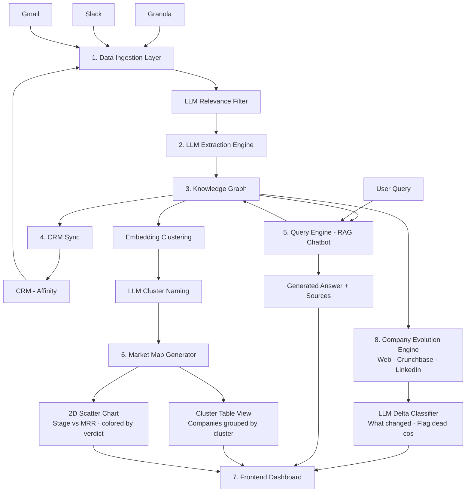

```mermaid
flowchart TD

    A[Granola] --> C
    B[CRM - Affinity] --> C
    J[Slack] --> C
    K[Gmail] --> C

    C[1. Data Ingestion Layer]
    C --> R[LLM Relevance Filter]
    R --> D[2. LLM Extraction Engine]

    D --> E[3. Knowledge Graph]

    E --> F[4. CRM Sync]
    E --> G[5. Query Engine - RAG Chatbot]
    E --> CL[Embedding Clustering]
    E --> EV[8. Company Evolution Engine<br/>Web · Crunchbase · LinkedIn]

    EV --> DC[LLM Delta Classifier<br/>What changed · Flag dead cos]
    DC --> I

    U[User Query] --> G
    G --> E
    G --> ANS[Generated Answer + Sources]

    CL --> LN[LLM Cluster Naming]
    LN --> H[6. Market Map Generator]

    H --> MM1[Cluster Table View<br/>Companies grouped by cluster]
    H --> MM2[2D Scatter Chart<br/>Stage vs MRR · colored by verdict]

    F --> B
    ANS --> I[7. Frontend Dashboard]
    MM1 --> I
    MM2 --> I
```
